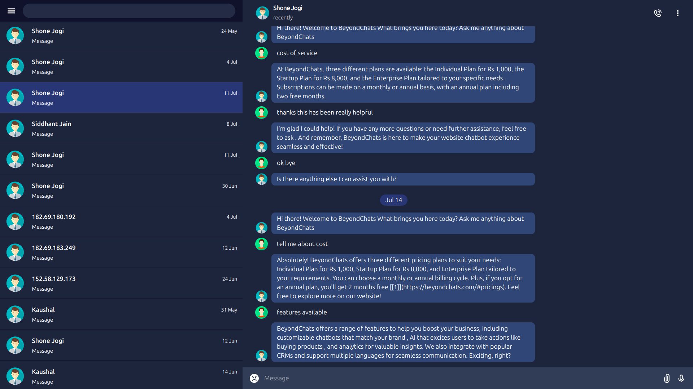

# Telegram-Assignment: frontend of telegram within 36 hours

This project replicates the user interface of Telegram.
## Installation


1. **Clone the repository**:

   ```sh
   git clone https://github.com/07kundan/Telegram-Asssignment.git
   cd Telegram-Asssignment
   ```

2. **Install dependencies**:

   ```sh
   npm install
   ```

3. **Run the development server**:

   ```sh
   npm start dev
   ```

4. **Open your browser**:
   Navigate to `http://localhost:5173` to see the application in action.

## Deployment

The project is automatically deployed to Netlify whenever changes are pushed to the `main` branch. You can access the live website at `https://telegram-assignment.netlify.app/`.

## Screenshots



## Technologies Used:

- **Frontend:**
  - React: A powerful JavaScript library for building user interfaces.
  - React-Query: React Query is a powerful library used for managing server state and caching data in React applications. It simplifies fetching, caching, synchronizing, and updating server     state in your application, making it easier to work with asynchronous data and handle complex UI interactions. .
  - React Icons: Provides a comprehensive set of SVG icons for various use cases, enhancing the visual appeal of the website.


